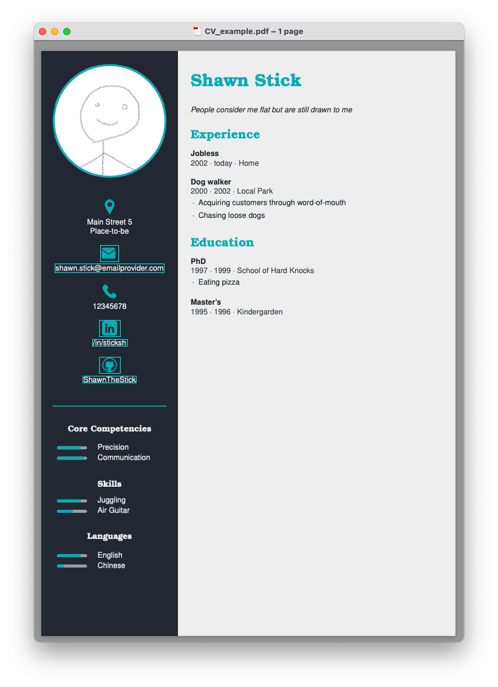

# LaTeX-CV

This repository contains an alternative solution to GUI-based CV creation tools.

The user specifies the contents of the CV using a YAML file. This file gets read by a Python script to manipulate a LaTeX template and afterwards the template gets compiled.

Alternatively, if you cannot be bothered with Python and are somewhat familiar with LaTeX, the template `./src/CV_template.tex` should be reasonably understable and can be used on its own.

## Example CV

```yaml
personal info:
    name: Shawn Stick
    photo path: pic.png
    address: |
        Main Street 5
        Place-to-be
    email: shawn.stick@emailprovider.com
    phone: 12345678
    linkedin: /in/sticksh
    github: ShawnTheStick
    about me: |
        People consider me flat but are still drawn to me

qualities:
    - Core Competencies:
        - Precision: .8
        - Communication: .9
    - Skills:
        - Juggling: .8
        - Air Guitar: .55
    - Languages:
        - English: .8
        - Chinese: .25

vita:
    - Experience:
        - Jobless:
            at: Home
            from: 2002
            to: today
        - Dog walker:
            at: Local Park
            from: 2000
            to: 2002
            doing:
                - Acquiring customers through word-of-mouth
                - Chasing loose dogs
    - Education:
        - PhD:
            at: School of Hard Knocks
            from: 1997
            to: 1999
            doing:
                - Eating pizza
        - Master's:
            at: Kindergarden
            from: 1995
            to: 1996
```



## Overview of Repository

```shell
├── input                  # input folder containing the base example
│   ├── example.yaml         # YAML file for building an example CV
│   └── pic.png              # image needed for the example.yaml
├── src                    # folder containing source codes, LaTeX templates, etc
│   ├── icons                # folder of icons embedded into the template
│   ├── example.png          # image of the example output for README
│   ├── latex_cv.py          # Python module which transforms and compiles the template
│   └── CV_template.tex      # LaTeX template getting transformed
├── output               # default output folder
├── main.py              # entry point to the python program flow
├── CV_config.yaml       # configuration file for input and output folder
├── README.md            # read-me file
└── requirements.txt     # requirements for running and developing the code
```

## Quickstart

Make sure the following is installed on your machine:
* LaTeX (incl. pdflatex and [latexmk](https://mg.readthedocs.io/latexmk.html))
* Python (any version of Python 3 should suffice)

If the above programs are installed, follow these steps:
1. Clone this repository via
    ```shell
   git clone https://github.com/KainAber/latex-cv.git
    ```
3. Optional: Configure a virtual environment for this project
3. Navigate inside the repository and install the requirements
    ```shell
    cd latex-cv
    pip install -r requirements.txt
    ```
4. Run `./main.py`

This last step generates a `.tex` file and then calls `subprocess.run` to execute a `latexmk` command compiling that `.tex` file.

Both the `.tex` and the `.pdf` file are created inside `./output` based on the `.yaml` file inside `./input` which was updated last (`example.yaml` in this case).

To create your own CV, simply create a `.yaml` file inside `./input` which mimics the contents of `./input/example.yaml` and re-run `main.py`.

## Customizations

In order to not have to work inside the repository folder, the file `./CV_config.yaml` affords the capability to change the the input folder (which is used to select the CV contents `.yaml` file) and the output folder (used for exporting `.tex` and `.pdf` files).

If you additionally create an alias in your shell configuration for the execution of `main.py`, you can essentially use this repository from anywhere inside your system.

## Detailed Config Guide

This section is going step through each part of the `example.yaml` file which the program uses to fill the CV template.

### Personal Info

* `personal info`
  * Dictionary of personal information which is retrieved by name
  * None of the fields of this dictionary are retrieved by name
  * The fields are iterated over and placed in the CV template
  * Placements without effect are logged
  * `name`
    * Name appearing on top the right-hand side of the CV (can also be used as a title)
  * `address`
    * Address which is placed under the `address.png` icon on the left-hand side; can be omitted / left blank to exclude the icon
  * `email`
    * Analogous to `address`; will additionally be linked out
  * `phone`
    * Analogous to `address`
  * `linkedin`
    * Analogous to `email`; use the LinkedIn url slug for the link to work, e.g. `/in/williamhgates`
  * `github`
    * Analogous to `linkedin`
  * `aboutme`
    * Free text field which will be placed under the `name` field on the right-hand side of the CV

### Qualities

* `qualities`
  * Dictionary of a list of quality sections which is retrieved by name
  * The quality sections themselves are not retrieved by name and can be set dynamically
  * They serve as headings on the left-hand side of the CV
  * `- Core Competencies`
    * Example name of a qualities section; will serve as a heading for its items
    * `- Communication`
      * Example of a quality under a quality section
      * The quality can be formatted as a key with a floating point number between 0 and 1 as a value; this floating point number describes the percentage of the degree of the quality
      * If a value is given, a progress bar will be placed next to the bulleted item
      * If the quality item is formatted as a list item or the value is omitted, the progress bar will be omitted as well

### Vita

* `vita`
  * Dictionary of a list of vita sections which is retrieved by name
  * As with `qualitiy`, the sections themselves are not retrieved by name and can be set dynamically
  * They serve as headings on the right-hand side of the CV
  * `- Experience`
    * Example name of a vita section; will serve as a heading for its items
    * `- Jobless`
      * Example of a vita item under a vita section
      * For vita sections like `Education`, the name of a degree can be used
      * `at`
        * Institution or company which this vita item refers to
      * `from`
        * Starting time which this vita item refers to
        * Can be any string
      * `to`
        * Analogous t `from`
      * `doing`
        * Option to add a description to the vita item in the form of a bulleted list

### Colors

* `colors`
  * Dictionary of colors which is retrieved by name
  * As with `personal info`, none of the fields of this dictionary are retrieved by name
  * The fields are iterated over and placed in the CV template
  * Placements without effect are logged
  * Colors codes have to be hexadecimal (hex) where the `#` can be omitted
  * `left side fill`
    * Fill color of the left-hand side of the CV
  * `left side accent`
    * Fill color of the photo border, the icons, the dividing line, and the progress bars on the left-hand side of the CV
  * `left side text`
    * Text color of the text on the left-hand side of the CV
  * `right side fill`
    * Fill color of the right-hand side of the CV
  * `right side accent`
    * Fill color of the name and vita section titles
  * `right side text`
    * Main text color of the left-hand side of the CV
  * `right side text`
    * Secondary text color of the left-hand side of the CV (used for `from`, `to`, `at` line of vita items)

### Geometry

* `geometry`
  * Dictionary of geometry constants which is retrieved by name
  * As with `personal info` and `colors`, none of the fields of this dictionary are retrieved by name
  * The fields are iterated over and placed in the CV template
  * Placements without effect are logged
  * For most of these, the default value can be kept
  * The text paddings are adjusted most frequently as they depend on the length of the CV
  * `left side ratio`
    * Floating point number between 0 and 1 which sets the percentage of the page width taken up by the left-hand side of the CV
    * Default is `.33`
  * `margins`
    * Size of top/bottom/left/right margins inside both sides of the CV
    * Must be formatted with a unit accepted by LaTeX
    * Default is `1.5em`
  * `left side text padding`
    * Size of vertical space between personal information and quality sections on the left-hand side of the CV
    * Must be formatted with a unit accepted by LaTeX
    * Default is `2em`
  * `right side text padding`
    * Size of vertical space between vita sections on the right-hand side of the CV
    * Must be formatted with a unit accepted by LaTeX
    * Default is `2em`
  * `photo border`
    * Size of outline around the photo
    * Must be formatted with a unit accepted by LaTeX
    * Default is `2pt`

### Language

* `language`
  * Name of the language used for hyphenation etc
  * Must be a valid argument of the [LaTeX babel package](https://en.wikibooks.org/wiki/LaTeX/Internationalization)
  * Default is `english`

## Future Updates

* More socials (suggestions welcome)
* More controls (e.g. fonts)

## Acknowledgements

* The icons are from [flaticon.com](https://www.flaticon.com/de/):
  * [address](https://www.flaticon.com/free-icon/stift_484167) by [Those Icons](https://www.flaticon.com/authors/those-icons)
  * [email](https://www.flaticon.com/free-icon/email_3059474) by [Ilham Fitrotul Hayat](https://www.flaticon.com/authors/ilham-fitrotul-hayat)
  * [github](https://www.flaticon.com/free-icon/social_16021236) by [iconsimple](https://www.flaticon.com/authors/iconsimple)
  * [linkedin](https://www.flaticon.com/free-icon/linkedin_3536569) by [riajulislam](https://www.flaticon.com/authors/riajulislam)
  * [phone](https://www.flaticon.com/free-icon/call_16703465) by [meaicon](https://www.flaticon.com/authors/meaicon)
* The `example.yaml` color scheme is from [colorhunt.co](https://colorhunt.co/palette/222831393e4600adb5eeeeee)
